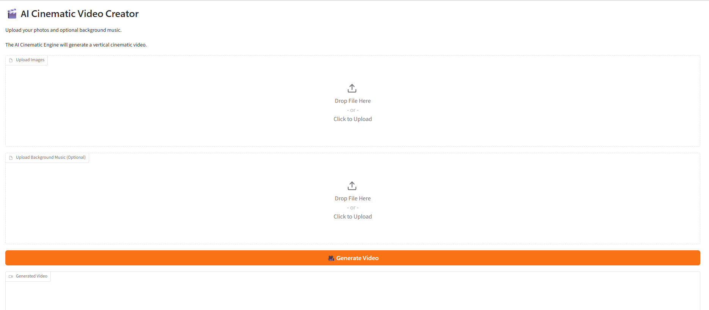

# AI Cinematic Video Creator Engine

An AI-powered cinematic video generation platform that transforms user-uploaded photos and optional background music into professional vertical videos for social media.

The application provides an intuitive Gradio web interface and a modular rendering engine capable of producing cinematic camera movements, smooth transitions, and high-quality MP4 output. The current release is V1.7, featuring refined cinematic motion, sizing optimization, and multi-segment video composition.

---

## Project Overview

The AI Cinematic Video Creator Engine is a modular Python-based video generation system designed to convert static images into cinematic vertical videos.

The platform combines:

- A Gradio web interface for user interaction
- A modular rendering architecture
- Custom cinematic motion logic
- MoviePy and FFmpeg video processing
- High-quality MP4 export

The goal is to provide an automated workflow for creating social-media-ready cinematic videos.

---

## Features

- Upload multiple images
- Optional background music
- Automatic cinematic slideshow generation
- Professional motion engine
- Vertical 1080 × 1920 video output
- MP4 export using FFmpeg
- Browser-based Gradio interface
- Modular rendering architecture
- Multiple cinematic animation segments

---

## Architecture

```text
                User
                  │
                  ▼
        Gradio Web Interface
                  │
                  ▼
          VideoRenderer
                  │
     ┌────────────┴────────────┐
     ▼                         ▼
 FrameEngine            Motion Engine
     │                         │
     └────────────┬────────────┘
                  ▼
        MoviePy + FFmpeg
                  │
                  ▼
        MP4 Video Output
```

---

## Project Structure

```text
TravelVideoStudio-clean/
│
├── app.py                  # Gradio web application
├── main.py                 # Command-line entry point
├── README.md
├── requirements.txt
│
├── engine/
│   └── core/
│       ├── frame_engine.py
│       ├── motion_engine.py
│       ├── segment_engine.py
│       └── video_renderer.py
│
├── docs/
│   ├── screenshots/
│   └── demo/
│
├── input/
├── output/
└── assets/
```

---

## Technology Stack

- Python
- Gradio
- MoviePy
- FFmpeg
- NumPy
- Pillow
- GitHub

---

## Screenshots

### Gradio Web Interface



### Generated Video Preview


---

## Demo Video

A demonstration of the AI Cinematic Video Creator Engine.

The demo shows:

- Uploading images
- Uploading optional background music
- Generating a cinematic video
- Final MP4 output

Demo location:

```text
docs/demo/cinematic-engine-v1.7-demo.mp4
```

---

## Installation

Clone the repository:

```bash
git clone https://github.com/monkamtanyi/cinematic-video-engine.git
cd cinematic-video-engine
```

Install dependencies:

```bash
pip install -r requirements.txt
```

---

## Usage

Launch the Gradio web application:

```bash
python app.py
```

Open your browser:

```text
http://127.0.0.1:7860
```

Workflow:

1. Upload images
2. Upload optional background music
3. Click **Generate Video**
4. Download the generated MP4 video

---

## Version History

| Version | Description |
|---|---|
| v1.0 | Initial cinematic video engine |
| v1.5 | Stable Gradio application with V5 renderer |
| v1.6 | Cinematic motion refinement |
| v1.7 | Cinematic sizing and motion polish |

---

## Future Roadmap

Planned enhancements:

- AI-selected camera movements
- Beat synchronization
- Animated travel maps
- Caption generation
- Theme engine
- Social media publishing integration
- Cloud deployment
- Automated CI/CD pipeline

---

## License

MIT License